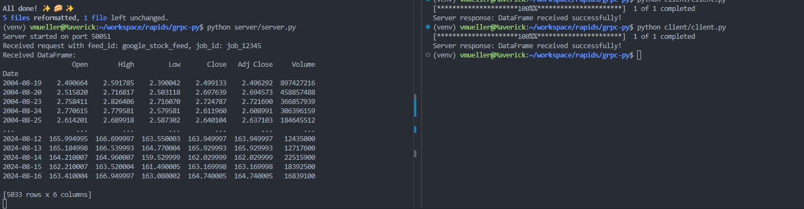

# Generate gRPC Code from Proto Files

The dataframe_service.proto file defines the gRPC service and message types. You need to generate Python code from this file using the protoc compiler.

Step 1: Install dependencies

> poetry install

Step 2: Generate server gRPC code files

> poetry run python -m grpc_tools.protoc -I./proto --python_out=./server --grpc_python_out=./server ./proto/dataframe_service.proto

Step 3: Genereta client gRPC code files

> poetry run python -m grpc_tools.protoc -I./proto --python_out=./client --grpc_python_out=./client ./proto/dataframe_service.proto

Step 4: Open terminal instance for the server

> python server/server.py

Step 5: Open terminal instance for the server

> python client/client.py

